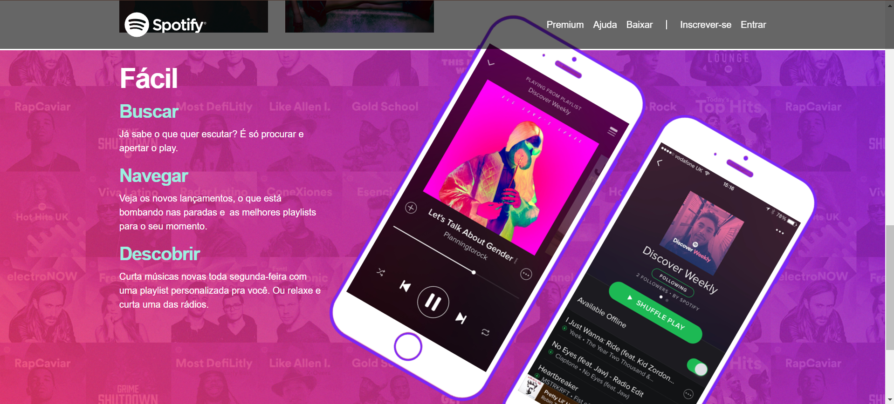

# README - Música para todos - Spotify

Este é um projeto de página web para apresentação do serviço Spotify, destacando seus recursos e funcionalidades principais.

## Tecnologias Utilizadas

- **HTML5**: Linguagem de marcação para estruturar o conteúdo da página.
- **CSS3**: Utilizado para estilização e design da página.
- **Bootstrap 4.1.3**: Framework front-end para agilizar o desenvolvimento, fornecendo componentes e estilos pré-definidos.
- **Font Awesome**: Biblioteca de ícones para adicionar ícones visualmente atraentes.
- **jQuery**: Biblioteca JavaScript para facilitar a manipulação do DOM e interações com o usuário.

## Estrutura do Projeto

- **index.html**: Arquivo principal contendo a estrutura da página.
- **estilo.css**: Arquivo de estilo personalizado para complementar o Bootstrap.
- **imagens/**: Diretório contendo as imagens utilizadas na página.

## Funcionalidades Principais

### Cabecalho (Header)
- Navegação responsiva com menu de navegação.
- Logotipo do Spotify.

### Seções
1. **Home**: Apresenta um slideshow com chamadas para ação.
2. **Serviços**: Destaca os principais serviços oferecidos pelo Spotify, como músicas, playlists e novos lançamentos.
3. **Recursos**: Apresenta os recursos do Spotify de forma mais detalhada.

### Rodapé (Footer)
- Links para informações sobre a empresa, comunidades e recursos úteis.
- Links para redes sociais.

## Como Executar

1. Baixe todos os arquivos deste repositório.
2. Abra o arquivo `index.html` em um navegador web compatível.
3. Explore a página e suas funcionalidades.

## Contribuindo

Contribuições são bem-vindas! Sinta-se à vontade para abrir uma issue ou enviar um pull request com melhorias ou correções.

